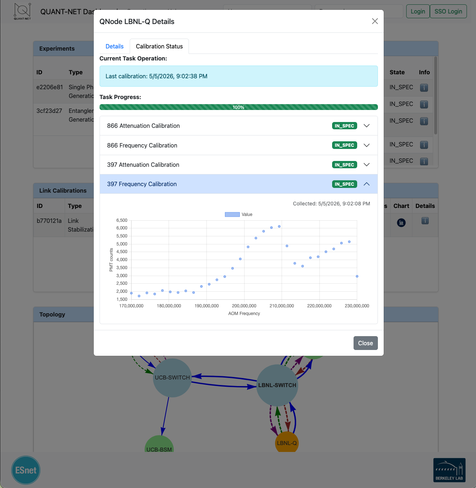

Northbound API
##############

.. pypi-shield::
    :project: quantnet-api
    :version:

.. github-shield::
    :last-commit:
    :repository: qn-api
    :branch: main

The northbound API server provides a RESTful interface for external applications to interact with the QUANT-NET control plane. It exposes endpoints for querying topology information, submitting experiments, and retrieving results. The API is designed to be intuitive and easy to use, enabling seamless integration with third-party tools and dashboards.

Running the API Server
----------------------

CLI
~~~

When installed as a package (``pip install quantnet-api``), the ``qn-api``
console script is available:

.. code-block:: console

   $ qn-api --help
   usage: qn-api [-h] [--host HOST] [--port PORT] [--reload]

   Run the Quant-Net API

   options:
     -h, --help   show this help message and exit
     --host HOST  Host to bind (default: 0.0.0.0)
     --port PORT  Port to bind (default: 8081)
     --reload     Enable auto-reload on file changes (development only)

Examples:

.. code-block:: console

   # Start on the default host/port (0.0.0.0:8081)
   $ qn-api

   # Bind to localhost on port 9000
   $ qn-api --host 127.0.0.1 --port 9000

   # Development mode with auto-reload
   $ qn-api --reload

Alternatively, you can run the module directly with ``uvicorn``:

.. code-block:: console

   $ uvicorn main:app --host 0.0.0.0 --port 8081 --reload

Docker
~~~~~~

For containerised deployments, the
`qn-docker <https://github.com/quant-net/qn-docker>`_ repository provides a
``docker-compose.yml`` that orchestrates the API server alongside the
Controller, agents, message broker, and database in a single test stack.
Refer to the ``qn-docker`` README for setup instructions.

Web Portal (Dashboard)
~~~~~~~~~~~~~~~~~~~~~~

The API server includes a web dashboard for interactive exploration of the network topology, agent calibration tasks, and experiment management. The dashboard is accessible at the root URL (``/``) when the server is running. 

Configuration File
------------------

The API server reads the same INI-style configuration file used by the
:doc:`Controller </server>`. The following paths are probed in order:

* ``$QUANTNET_HOME/etc/quantnet.cfg``
* ``$VIRTUAL_ENV/etc/quantnet.cfg``
* ``/opt/quantnet/etc/quantnet.cfg``

If no file is found the server logs a warning and continues with built-in
defaults.

Example (API-relevant sections only): ::

  [mq]
  host = 127.0.0.1
  port = 1883
  mongo_host = 127.0.0.1
  mongo_port = 27017
  ws_host = 127.0.0.1
  ws_port = 8080
  rpc_server_topic = quantnet/rpc/server
  rpc_client_topic = quantnet/rpc/client

  [schemas]
  path = /opt/qn-plugins/schema

  [main]
  request_types = ["spgRequest", "egpRequest", "bsmRequest"]

[mq]
====

.. confval:: api_mq_host

   :type: string
   :default: ``127.0.0.1``

   The MQTT broker host used for RPC communication with the Controller.

.. confval:: api_mq_port

   :type: string
   :default: ``1883``

   The MQTT broker port.

.. confval:: api_mongo_host

   :type: string
   :default: ``127.0.0.1``

   The MongoDB host used by the message bus layer.

.. confval:: api_mongo_port

   :type: string
   :default: ``27017``

   The MongoDB port used by the message bus layer.

.. confval:: api_ws_host

   :type: string
   :default: ``127.0.0.1``

   The WebSocket host exposed to the web dashboard for live updates.

.. confval:: api_ws_port

   :type: string
   :default: ``8080``

   The WebSocket port exposed to the web dashboard.

.. confval:: rpc_server_topic

   :type: string

   The MQTT topic the Controller listens on for RPC requests.

.. confval:: rpc_client_topic

   :type: string

   The MQTT topic the API subscribes to for RPC responses.

.. confval:: api_mq_path

   :type: string

   Optional filesystem path used by the message bus layer.

[schemas]
=========

.. confval:: api_schema_path

   :type: string

   Path to a directory of YAML schemas conforming to the :doc:`Message Bus </comms>` spec.
   When set, schemas are loaded at startup so the RPC client can validate
   messages.

[main]
======

.. confval:: request_types

   :type: list
   :default: ``["spgRequest", "egpRequest", "bsmRequest"]``

   The experiment request types surfaced in the web dashboard's request
   submission form.

FastAPI Application
-------------------

The application is defined in ``main.py`` and assembled from the components
described below.

Router & Endpoints
~~~~~~~~~~~~~~~~~~

All REST endpoints are grouped under the ``/api`` prefix via a dedicated
``APIRouter``. The table below summarises the available routes:

.. list-table::
   :header-rows: 1
   :widths: 10 30 60

   * - Method
     - Path
     - Description
   * - GET
     - ``/api/topology``
     - Retrieve the network topology graph. Pass ``?full=true`` for complete
       node definitions including channel data.
   * - GET
     - ``/api/node``
     - List all nodes in the network.
   * - GET
     - ``/api/node/{ID}``
     - Get information for a specific node by its identifier.
   * - GET
     - ``/api/experiments``
     - List all experiments. Supports ``?last=true``, ``?request=true``, and
       ``?agent_id=<id>`` query parameters.
   * - GET
     - ``/api/experiments/{expid}``
     - Get a specific experiment by ID.
   * - GET
     - ``/api/calibration``
     - List all calibrations. Supports ``?last=true``.
   * - GET
     - ``/api/calibration/{calid}``
     - Get a specific calibration by ID.
   * - GET
     - ``/api/tasks``
     - Get agent task results. Supports ``?agent_id=<id>``.
   * - POST
     - ``/api/pingpong``
     - Send ping requests to a list of remote nodes.
       Parameters: ``remotes`` (list), ``iterations`` (int, default 5).
   * - POST
     - ``/api/calibrate``
     - Run a calibration process.
       Parameters: ``type``, ``src``, ``dst``, ``power``, ``light``.
   * - POST
     - ``/api/bsm``
     - Start a BSM experiment.
       Parameters: ``src`` (list), ``rate`` (float), ``duration`` (float).
   * - POST
     - ``/api/spg``
     - Start a single-photon generation experiment.
       Parameters: ``src`` (list), ``rate`` (float), ``duration`` (float).
   * - POST
     - ``/api/egp``
     - Start an entanglement generation experiment.
       Parameters: ``src``, ``dst``, ``pairs``, ``bellState``, ``fidelity``.

Interactive API documentation is auto-generated by FastAPI and available at
``/docs`` (Swagger UI) and ``/redoc`` (ReDoc) when the server is running.

Error Handling
~~~~~~~~~~~~~~

Every endpoint delegates to a centralised ``_rpc_request`` helper that wraps
the underlying RPC call with uniform error handling:

* **504 Gateway Timeout** — returned when the Controller does not respond
  within the RPC timeout window (default 10 s).
* **502 Bad Gateway** — returned for any other communication failure with the
  Controller.

Both responses include a JSON body with ``error`` and ``detail`` fields.

OpenAPI Schema
~~~~~~~~~~~~~~

A custom OpenAPI schema is generated at startup with the title
**Quant-Net API**. The interactive documentation is served at:

* ``/docs`` — Swagger UI
* ``/redoc`` — ReDoc
